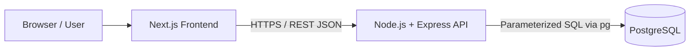
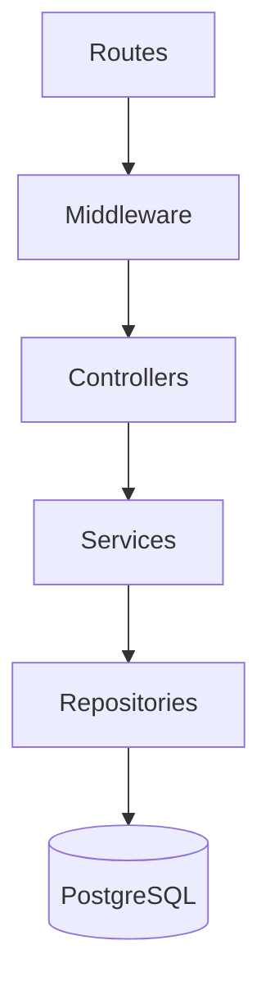
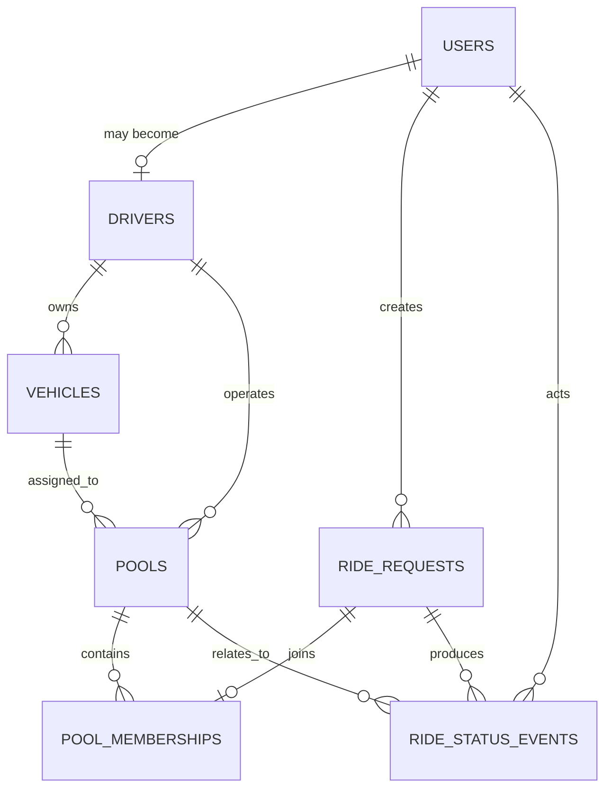
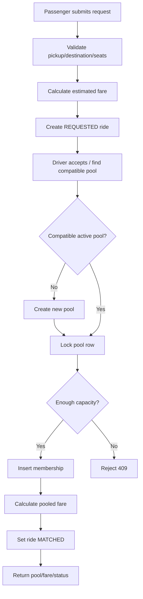
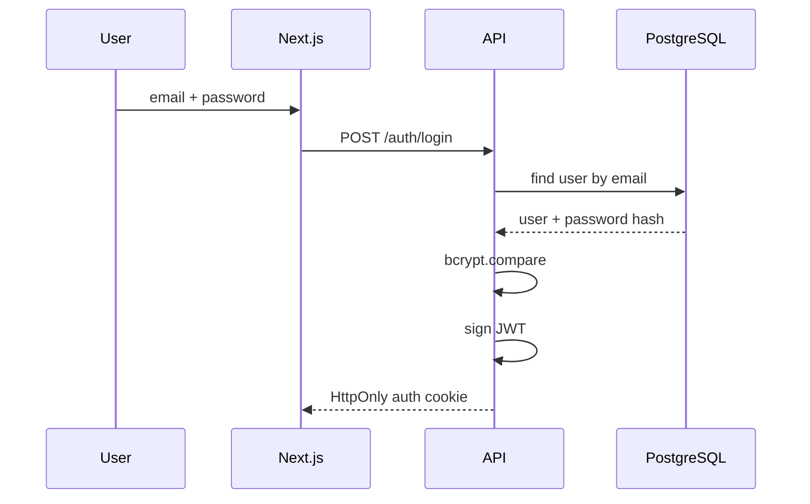
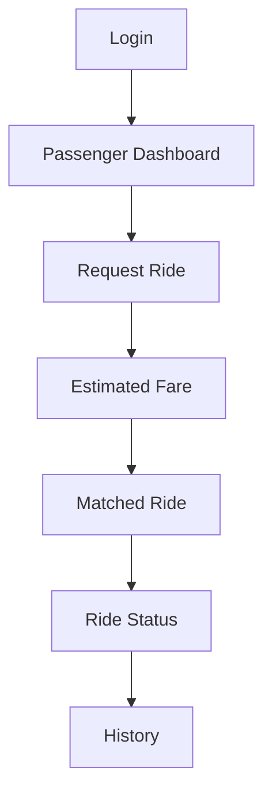
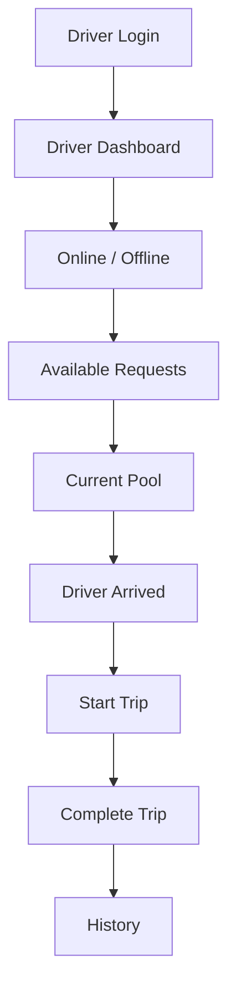
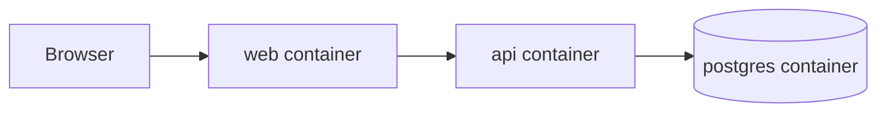

# Dhaka Tesla Pool — Final Engineering Blueprint

> **Purpose:** Internship MVP submission blueprint  
> **Stack:** Next.js + Node.js/Express + PostgreSQL  
> **Database access:** Raw SQL with `pg` (`node-postgres`) — **no ORM / no Prisma**  
> **Primary goal:** Build a small, correct, easy-to-explain ride-pooling system with strong data integrity, clear architecture, meaningful Git history, tests, Docker, documentation, and a six-minute demo.

---

## 1. Project Summary

**Dhaka Tesla Pool** is a ride-pooling MVP for Dhaka.

The story revolves around:

- **Jashim** — driver
- **Bullet** — Jashim's battery-powered three-seat "Tesla"
- **Nusrat** — passenger traveling from Banani to Mohakhali
- **Rafiq** — passenger traveling from Banani to Gulshan 1
- **Shirin** — another passenger who may attempt to take the final available seat

The system must allow passengers to request rides, allow compatible ride requests to share one vehicle, ensure the vehicle is never overbooked, calculate an individual fare for each passenger, let the driver manage the ride lifecycle, and preserve enough history to explain what happened later.

This is not intended to be a Google Maps clone. The important engineering problems are authentication, authorization, lifecycle correctness, pool membership, capacity protection, fares, concurrency, audit history, testing, Docker, Git process, and documentation.

---

# 2. MVP Goals

## 2.1 Passenger

A passenger can:

- register and sign in,
- request a ride,
- choose pickup area,
- choose destination area,
- choose seat count,
- see an estimated fare,
- track ride status,
- see their own pooled/final fare,
- cancel while cancellation is valid,
- see ride history,
- access only their own private ride/fare information.

## 2.2 Driver

A driver can:

- sign in,
- go online/offline,
- see the assigned Tesla,
- see capacity,
- see relevant waiting requests,
- accept a request/pool,
- see pool passengers and seat usage,
- mark arrival,
- start the ride,
- complete the ride,
- see ride history.

## 2.3 Pooling

The pooling system must:

- allow multiple compatible requests in one Tesla,
- never exceed capacity,
- make pool membership obvious,
- keep each passenger's fare separate,
- prevent joining after the ride starts,
- reject incompatible requests,
- protect the final seat against concurrent claims.

---

# 3. Explicit Non-Goals

Do not spend MVP time on:

- real Google Maps route optimization,
- real-time GPS,
- real card/bank payments,
- chat,
- push notifications,
- surge-pricing engines,
- reviews/ratings,
- Kafka,
- Kubernetes,
- Redis just for appearance,
- microservices,
- queues in the MVP,
- ML matching.

Build something **simple, correct, deliberate, and explainable**.

---

# 4. Final Recommended Stack

## Frontend

- **Next.js**
- **App Router**
- **TypeScript**
- native `fetch`
- Tailwind CSS or CSS Modules
- Zod for form validation if desired

## Backend

- **Node.js**
- **Express**
- **TypeScript**
- **pg / node-postgres**
- **Zod** for request validation
- **bcrypt** for password hashing
- **jsonwebtoken** for JWT auth

## Database

- **PostgreSQL**
- raw SQL
- SQL migration files
- PostgreSQL transactions
- `SELECT ... FOR UPDATE` for critical seat allocation

## Testing

- **Vitest** or Jest
- **Supertest**
- isolated PostgreSQL test database

## Dev / deployment

- Docker
- Docker Compose
- `.env.example`
- migration scripts
- seed scripts
- health checks

---

# 5. Why No Prisma / ORM?

Using Prisma is **not required**.

For this project, raw SQL with `pg` is a valid and defensible choice.

```bash
npm install pg
```

### Why raw SQL fits this challenge

- Every query is visible.
- Transactions are explicit.
- Row locking is easier to reason about.
- Database constraints are not hidden behind an abstraction.
- Debugging SQL/data-consistency problems is direct.
- You can explain every table, join, lock, and query in the interview.

### Trade-off

Raw SQL means more boilerplate and more responsibility for mapping/query organization.

### When to switch later

If the product grows to many tables and queries, a typed query builder or ORM such as Drizzle/Prisma may improve productivity. For this MVP, explicit SQL is reasonable because the data model is compact and concurrency is important.

---

# 6. Repository Strategy

Use one repository with a clear frontend/backend/database split.

```text
dhaka-tesla-pool/
├── apps/
│   ├── web/            # Next.js frontend only
│   └── api/            # Express backend only
├── database/           # migrations, seeds, DB scripts
├── docs/               # architecture, ERD, decisions, scaling
├── scripts/            # project-level helper scripts
├── docker-compose.yml
├── .env.example
├── .gitignore
├── package.json
└── README.md
```

The structure is intentionally boring and predictable so bugs are easy to locate.

---

# 7. Full Professional Folder Structure

```text
dhaka-tesla-pool/
│
├── apps/
│   │
│   ├── web/
│   │   ├── src/
│   │   │   ├── app/
│   │   │   │   ├── (public)/
│   │   │   │   │   ├── login/page.tsx
│   │   │   │   │   └── register/page.tsx
│   │   │   │   ├── (passenger)/
│   │   │   │   │   └── passenger/
│   │   │   │   │       ├── page.tsx
│   │   │   │   │       ├── request/page.tsx
│   │   │   │   │       ├── current-ride/page.tsx
│   │   │   │   │       └── history/page.tsx
│   │   │   │   ├── (driver)/
│   │   │   │   │   └── driver/
│   │   │   │   │       ├── page.tsx
│   │   │   │   │       ├── requests/page.tsx
│   │   │   │   │       ├── current-pool/page.tsx
│   │   │   │   │       └── history/page.tsx
│   │   │   │   ├── layout.tsx
│   │   │   │   ├── page.tsx
│   │   │   │   ├── loading.tsx
│   │   │   │   ├── error.tsx
│   │   │   │   └── not-found.tsx
│   │   │   ├── components/
│   │   │   │   ├── auth/
│   │   │   │   │   ├── LoginForm.tsx
│   │   │   │   │   └── RegisterForm.tsx
│   │   │   │   ├── passenger/
│   │   │   │   │   ├── RideRequestForm.tsx
│   │   │   │   │   ├── FareEstimate.tsx
│   │   │   │   │   ├── RideStatusCard.tsx
│   │   │   │   │   └── RideHistoryTable.tsx
│   │   │   │   ├── driver/
│   │   │   │   │   ├── DriverStatusToggle.tsx
│   │   │   │   │   ├── RequestCard.tsx
│   │   │   │   │   ├── PoolSummary.tsx
│   │   │   │   │   └── PoolActionButtons.tsx
│   │   │   │   ├── shared/
│   │   │   │   │   ├── Button.tsx
│   │   │   │   │   ├── Input.tsx
│   │   │   │   │   ├── Select.tsx
│   │   │   │   │   ├── Badge.tsx
│   │   │   │   │   ├── EmptyState.tsx
│   │   │   │   │   ├── ErrorMessage.tsx
│   │   │   │   │   └── Spinner.tsx
│   │   │   │   └── layout/
│   │   │   │       ├── Navbar.tsx
│   │   │   │       └── DashboardShell.tsx
│   │   │   ├── lib/
│   │   │   │   ├── api/
│   │   │   │   │   ├── client.ts
│   │   │   │   │   ├── auth.api.ts
│   │   │   │   │   ├── rides.api.ts
│   │   │   │   │   ├── driver.api.ts
│   │   │   │   │   └── pools.api.ts
│   │   │   │   ├── auth/auth.ts
│   │   │   │   ├── constants/
│   │   │   │   │   ├── areas.ts
│   │   │   │   │   └── ride-status.ts
│   │   │   │   ├── format/
│   │   │   │   │   ├── money.ts
│   │   │   │   │   └── date.ts
│   │   │   │   └── validation/ride-form.schema.ts
│   │   │   ├── hooks/
│   │   │   │   ├── useCurrentRide.ts
│   │   │   │   └── useDriverPool.ts
│   │   │   ├── types/
│   │   │   │   ├── auth.ts
│   │   │   │   ├── ride.ts
│   │   │   │   ├── pool.ts
│   │   │   │   └── api.ts
│   │   │   └── middleware.ts
│   │   ├── public/
│   │   ├── .env.example
│   │   ├── Dockerfile
│   │   ├── next.config.ts
│   │   ├── package.json
│   │   └── tsconfig.json
│   │
│   └── api/
│       ├── src/
│       │   ├── app.ts
│       │   ├── server.ts
│       │   ├── config/
│       │   │   ├── env.ts
│       │   │   └── constants.ts
│       │   ├── db/
│       │   │   ├── pool.ts
│       │   │   ├── transaction.ts
│       │   │   └── health.ts
│       │   ├── middleware/
│       │   │   ├── auth.middleware.ts
│       │   │   ├── role.middleware.ts
│       │   │   ├── validate.middleware.ts
│       │   │   ├── error.middleware.ts
│       │   │   ├── not-found.middleware.ts
│       │   │   └── request-id.middleware.ts
│       │   ├── modules/
│       │   │   ├── auth/
│       │   │   │   ├── auth.routes.ts
│       │   │   │   ├── auth.controller.ts
│       │   │   │   ├── auth.service.ts
│       │   │   │   ├── auth.repository.ts
│       │   │   │   ├── auth.schema.ts
│       │   │   │   └── auth.types.ts
│       │   │   ├── users/
│       │   │   │   ├── users.routes.ts
│       │   │   │   ├── users.controller.ts
│       │   │   │   ├── users.service.ts
│       │   │   │   ├── users.repository.ts
│       │   │   │   └── users.types.ts
│       │   │   ├── drivers/
│       │   │   │   ├── drivers.routes.ts
│       │   │   │   ├── drivers.controller.ts
│       │   │   │   ├── drivers.service.ts
│       │   │   │   ├── drivers.repository.ts
│       │   │   │   └── drivers.schema.ts
│       │   │   ├── vehicles/
│       │   │   │   ├── vehicles.service.ts
│       │   │   │   ├── vehicles.repository.ts
│       │   │   │   └── vehicles.types.ts
│       │   │   ├── rides/
│       │   │   │   ├── rides.routes.ts
│       │   │   │   ├── rides.controller.ts
│       │   │   │   ├── rides.service.ts
│       │   │   │   ├── rides.repository.ts
│       │   │   │   ├── rides.schema.ts
│       │   │   │   ├── rides.types.ts
│       │   │   │   └── ride-state-machine.ts
│       │   │   ├── pools/
│       │   │   │   ├── pools.routes.ts
│       │   │   │   ├── pools.controller.ts
│       │   │   │   ├── pools.service.ts
│       │   │   │   ├── pools.repository.ts
│       │   │   │   ├── pools.schema.ts
│       │   │   │   └── pools.types.ts
│       │   │   ├── matching/
│       │   │   │   ├── matching.service.ts
│       │   │   │   ├── compatibility.ts
│       │   │   │   └── matching.types.ts
│       │   │   ├── fares/
│       │   │   │   ├── fares.service.ts
│       │   │   │   ├── fare-rules.ts
│       │   │   │   └── fares.types.ts
│       │   │   └── history/
│       │   │       ├── history.service.ts
│       │   │       └── history.repository.ts
│       │   ├── shared/
│       │   │   ├── errors/
│       │   │   │   ├── AppError.ts
│       │   │   │   ├── error-codes.ts
│       │   │   │   └── http-errors.ts
│       │   │   ├── logger/logger.ts
│       │   │   ├── security/
│       │   │   │   ├── password.ts
│       │   │   │   └── jwt.ts
│       │   │   └── utils/
│       │   │       ├── money.ts
│       │   │       └── dates.ts
│       │   └── routes/index.ts
│       ├── tests/
│       │   ├── integration/
│       │   │   ├── auth.test.ts
│       │   │   ├── ride-request.test.ts
│       │   │   ├── pooling.test.ts
│       │   │   ├── concurrency.test.ts
│       │   │   ├── authorization.test.ts
│       │   │   └── lifecycle.test.ts
│       │   ├── unit/
│       │   │   ├── fare.service.test.ts
│       │   │   ├── compatibility.test.ts
│       │   │   └── ride-state-machine.test.ts
│       │   └── helpers/
│       │       ├── test-db.ts
│       │       └── factories.ts
│       ├── .env.example
│       ├── Dockerfile
│       ├── package.json
│       └── tsconfig.json
│
├── database/
│   ├── migrations/
│   │   ├── 001_create_users.sql
│   │   ├── 002_create_drivers.sql
│   │   ├── 003_create_vehicles.sql
│   │   ├── 004_create_ride_requests.sql
│   │   ├── 005_create_pools.sql
│   │   ├── 006_create_pool_memberships.sql
│   │   ├── 007_create_ride_status_events.sql
│   │   └── 008_add_indexes.sql
│   ├── seeds/
│   │   ├── 001_users.sql
│   │   ├── 002_driver_vehicle.sql
│   │   └── 003_demo_rides.sql
│   ├── scripts/
│   │   ├── migrate.ts
│   │   ├── rollback.ts
│   │   ├── seed.ts
│   │   └── reset.ts
│   └── README.md
│
├── docs/
│   ├── architecture.md
│   ├── erd.md
│   ├── assumptions.md
│   ├── api.md
│   ├── decisions/
│   │   ├── 001-postgresql.md
│   │   ├── 002-raw-sql.md
│   │   ├── 003-rest-api.md
│   │   ├── 004-zone-matching.md
│   │   └── 005-concurrency.md
│   ├── testing.md
│   ├── security.md
│   ├── scaling.md
│   └── demo-script.md
│
├── scripts/
│   ├── dev.sh
│   ├── test.sh
│   └── docker-reset.sh
│
├── docker-compose.yml
├── .env.example
├── .gitignore
├── package.json
├── README.md
└── LICENSE
```

---

# 8. Why This Structure Makes Debugging Easy

The backend follows one predictable flow:

```text
route
  ↓
controller
  ↓
service
  ↓
repository
  ↓
database
```

## Route

Defines URL, HTTP method, middleware, and controller.

Example:

```text
POST /api/rides
```

Lives in:

```text
modules/rides/rides.routes.ts
```

## Controller

Handles HTTP-specific work:

- request,
- response,
- status code,
- calling the service.

Controllers should not contain SQL or major domain logic.

## Service

Contains business rules:

- can this ride be cancelled?
- can this request join this pool?
- calculate fare,
- reserve capacity,
- transition status.

## Repository

Contains database queries only.

Examples:

```ts
findRideById(...)
createRide(...)
lockPoolForUpdate(...)
insertMembership(...)
```

Repositories should not decide product rules.

## Database

PostgreSQL enforces:

- foreign keys,
- unique constraints,
- check constraints,
- transactions,
- indexes.

---

# 9. Fast Bug-Finding Map

| Problem | First place to inspect |
|---|---|
| wrong UI/button | `apps/web/src/components/` |
| wrong API URL/request | `apps/web/src/lib/api/` |
| invalid form/client validation | `apps/web/src/lib/validation/` |
| backend input validation | `apps/api/src/modules/*/*.schema.ts` |
| wrong HTTP status/response | controller |
| wrong business rule | service |
| wrong SQL/result mapping | repository |
| wrong fare | `modules/fares/` |
| wrong matching | `modules/matching/` |
| invalid lifecycle | `rides/ride-state-machine.ts` |
| DB schema problem | `database/migrations/` |
| demo data problem | `database/seeds/` |
| login/token issue | `modules/auth/`, auth middleware, security helpers |
| overbooking/race condition | pools service + pools repository + transaction helper |

---

# 10. High-Level Architecture



### Next.js is responsible for

- pages and components,
- forms,
- loading/error/empty states,
- rendering data,
- making API calls.

### Express API is responsible for

- auth,
- authorization,
- validation,
- matching,
- fare rules,
- lifecycle rules,
- capacity enforcement,
- transactions,
- logging.

### PostgreSQL is responsible for

- durable data,
- relationships,
- constraints,
- indexes,
- transactions,
- concurrency locks,
- status history.

---

# 11. Backend Internal Architecture



Avoid shortcuts such as:

```text
route -> SQL
```

Prefer:

```text
route -> controller -> service -> repository -> database
```

---

# 12. Domain Model



### Important distinction

- **RideRequest** = one passenger's requested journey.
- **Pool** = shared trip operated by one driver/vehicle.
- **PoolMembership** = connection between a request and a pool.

This separation makes fares, cancellation, pooling, capacity, and history much easier to reason about.

---

# 13. Recommended Database Schema

## `users`

```sql
CREATE TABLE users (
    id UUID PRIMARY KEY,
    name VARCHAR(100) NOT NULL,
    email VARCHAR(255) NOT NULL UNIQUE,
    password_hash TEXT NOT NULL,
    role VARCHAR(20) NOT NULL
        CHECK (role IN ('PASSENGER', 'DRIVER')),
    created_at TIMESTAMPTZ NOT NULL DEFAULT NOW(),
    updated_at TIMESTAMPTZ NOT NULL DEFAULT NOW()
);
```

## `drivers`

```sql
CREATE TABLE drivers (
    id UUID PRIMARY KEY,
    user_id UUID NOT NULL UNIQUE
        REFERENCES users(id) ON DELETE CASCADE,
    is_online BOOLEAN NOT NULL DEFAULT FALSE,
    created_at TIMESTAMPTZ NOT NULL DEFAULT NOW()
);
```

## `vehicles`

```sql
CREATE TABLE vehicles (
    id UUID PRIMARY KEY,
    driver_id UUID NOT NULL REFERENCES drivers(id),
    name VARCHAR(100) NOT NULL,
    capacity SMALLINT NOT NULL CHECK (capacity > 0),
    is_active BOOLEAN NOT NULL DEFAULT TRUE,
    created_at TIMESTAMPTZ NOT NULL DEFAULT NOW()
);
```

Demo seed:

```text
Driver: Jashim
Vehicle: Bullet
Capacity: 3
```

## `ride_requests`

```sql
CREATE TABLE ride_requests (
    id UUID PRIMARY KEY,
    passenger_id UUID NOT NULL REFERENCES users(id),
    pickup_zone VARCHAR(50) NOT NULL,
    destination_zone VARCHAR(50) NOT NULL,
    seats_requested SMALLINT NOT NULL CHECK (seats_requested > 0),
    status VARCHAR(30) NOT NULL
        CHECK (status IN (
            'REQUESTED',
            'MATCHED',
            'DRIVER_ARRIVED',
            'STARTED',
            'COMPLETED',
            'CANCELLED'
        )),
    estimated_fare_poysha INTEGER NOT NULL
        CHECK (estimated_fare_poysha >= 0),
    created_at TIMESTAMPTZ NOT NULL DEFAULT NOW(),
    cancelled_at TIMESTAMPTZ
);
```

## `pools`

```sql
CREATE TABLE pools (
    id UUID PRIMARY KEY,
    driver_id UUID NOT NULL REFERENCES drivers(id),
    vehicle_id UUID NOT NULL REFERENCES vehicles(id),
    status VARCHAR(30) NOT NULL
        CHECK (status IN (
            'MATCHED',
            'DRIVER_ARRIVED',
            'STARTED',
            'COMPLETED',
            'CANCELLED'
        )),
    capacity_snapshot SMALLINT NOT NULL CHECK (capacity_snapshot > 0),
    created_at TIMESTAMPTZ NOT NULL DEFAULT NOW(),
    started_at TIMESTAMPTZ,
    completed_at TIMESTAMPTZ
);
```

`capacity_snapshot` preserves historical truth even if the vehicle capacity is changed later.

## `pool_memberships`

```sql
CREATE TABLE pool_memberships (
    id UUID PRIMARY KEY,
    pool_id UUID NOT NULL REFERENCES pools(id) ON DELETE CASCADE,
    ride_request_id UUID NOT NULL UNIQUE
        REFERENCES ride_requests(id) ON DELETE CASCADE,
    seats_reserved SMALLINT NOT NULL CHECK (seats_reserved > 0),
    fare_poysha INTEGER NOT NULL CHECK (fare_poysha >= 0),
    status VARCHAR(20) NOT NULL
        CHECK (status IN ('ACTIVE', 'CANCELLED')),
    joined_at TIMESTAMPTZ NOT NULL DEFAULT NOW(),
    cancelled_at TIMESTAMPTZ
);
```

## `ride_status_events`

```sql
CREATE TABLE ride_status_events (
    id UUID PRIMARY KEY,
    ride_request_id UUID REFERENCES ride_requests(id),
    pool_id UUID REFERENCES pools(id),
    actor_user_id UUID REFERENCES users(id),
    from_status VARCHAR(30),
    to_status VARCHAR(30) NOT NULL,
    created_at TIMESTAMPTZ NOT NULL DEFAULT NOW()
);
```

Example history:

```text
08:41 REQUESTED
08:43 MATCHED
08:48 DRIVER_ARRIVED
08:50 STARTED
09:03 COMPLETED
```

---

# 14. Important Indexes

```sql
CREATE INDEX idx_ride_requests_passenger
ON ride_requests(passenger_id);

CREATE INDEX idx_ride_requests_status
ON ride_requests(status);

CREATE INDEX idx_ride_requests_pickup_destination
ON ride_requests(pickup_zone, destination_zone);

CREATE INDEX idx_pools_driver_status
ON pools(driver_id, status);

CREATE INDEX idx_pool_memberships_pool
ON pool_memberships(pool_id);

CREATE INDEX idx_status_events_ride
ON ride_status_events(ride_request_id, created_at);
```

Do not add indexes without explaining which query they help.

---

# 15. Geography Model

Use a predefined Dhaka area list.

```ts
export const DHAKA_AREAS = [
  "Banani",
  "Gulshan 1",
  "Gulshan 2",
  "Mohakhali",
  "Dhanmondi",
  "Mirpur",
  "Uttara",
  "Farmgate",
  "Bashundhara",
] as const;
```

No paid map API is needed.

---

# 16. Matching Rule

Recommended MVP assumption:

Two ride requests can share a pool when:

1. pickup zone is the same,
2. destination is the same or configured as compatible,
3. pool has not started,
4. enough seats remain,
5. driver is online,
6. vehicle is active.

Example compatibility:

```ts
const destinationCompatibility = {
  Banani: ["Mohakhali", "Gulshan 1"],
};
```

Therefore:

```text
Nusrat: Banani -> Mohakhali
Rafiq:  Banani -> Gulshan 1
```

can share Bullet.

Keep the rule deterministic and document it.

---

# 17. Matching Flow



---

# 18. Ride State Machine

```text
REQUESTED
    ↓
MATCHED
    ↓
DRIVER_ARRIVED
    ↓
STARTED
    ↓
COMPLETED
```

Recommended cancellation rule:

```text
REQUESTED      -> CANCELLED
MATCHED        -> CANCELLED
DRIVER_ARRIVED -> CANCELLED
STARTED        -> cancellation rejected
```

Centralize this rule:

```ts
export const VALID_TRANSITIONS = {
  REQUESTED: ["MATCHED", "CANCELLED"],
  MATCHED: ["DRIVER_ARRIVED", "CANCELLED"],
  DRIVER_ARRIVED: ["STARTED", "CANCELLED"],
  STARTED: ["COMPLETED"],
  COMPLETED: [],
  CANCELLED: [],
} as const;
```

Never let arbitrary controllers update status directly.

---

# 19. Fare Model

Keep it manually testable.

```text
fare = baseFare + distanceCharge - poolDiscount
```

Example constants:

```text
Base fare       = ৳50
Distance charge = ৳12/km
Pool discount   = ৳15
```

Store money as **integer poysha**.

```text
৳50.00 = 5000 poysha
```

Example:

```text
Nusrat
Banani -> Mohakhali
Distance = 3 km

৳50 + (3 × ৳12) - ৳15
= ৳71
= 7100 poysha
```

```text
Rafiq
Banani -> Gulshan 1
Distance = 2 km

৳50 + (2 × ৳12) - ৳15
= ৳59
= 5900 poysha
```

The exact constants can be changed, but the formula must stay easy to test by hand.

---

# 20. Fare Lifecycle

At request creation:

```text
ride_requests.estimated_fare_poysha
```

After pool assignment:

```text
pool_memberships.fare_poysha
```

Recommended assumption: **lock the final fare once the trip starts**.

---

# 21. Concurrency — Critical Requirement

Scenario:

```text
Bullet capacity = 3
occupied seats = 2
remaining = 1
```

Two users try to claim the final seat at nearly the same instant.

A bad implementation performs:

```ts
const available = await getAvailableSeats();
if (available >= 1) {
  await insertMembership();
}
```

Both requests may read one available seat before either inserts.

Result: overbooking.

---

# 22. Correct Concurrency Strategy

Use a PostgreSQL transaction and row lock.

```text
BEGIN

SELECT pool FOR UPDATE

calculate active reserved seats

if requested seats > remaining:
    ROLLBACK
    return 409

INSERT membership
UPDATE ride state/history

COMMIT
```

Critical query:

```sql
SELECT *
FROM pools
WHERE id = $1
FOR UPDATE;
```

Example flow with `pg`:

```ts
const client = await db.connect();

try {
  await client.query("BEGIN");

  const poolResult = await client.query(
    `SELECT *
     FROM pools
     WHERE id = $1
     FOR UPDATE`,
    [poolId]
  );

  const seatsResult = await client.query(
    `SELECT COALESCE(SUM(seats_reserved), 0) AS occupied
     FROM pool_memberships
     WHERE pool_id = $1
       AND status = 'ACTIVE'`,
    [poolId]
  );

  const occupied = Number(seatsResult.rows[0].occupied);
  const capacity = Number(poolResult.rows[0].capacity_snapshot);

  if (occupied + seatsRequested > capacity) {
    throw new AppError(
      "POOL_FULL",
      "No seats are available in this Tesla.",
      409
    );
  }

  await client.query(
    `INSERT INTO pool_memberships (...)
     VALUES (...)`
  );

  await client.query("COMMIT");
} catch (error) {
  await client.query("ROLLBACK");
  throw error;
} finally {
  client.release();
}
```

This is one of the most important parts to understand for the interview.

---

# 23. Authentication

Recommended MVP:

- email/password,
- bcrypt password hash,
- JWT,
- HttpOnly cookie.



Never store raw passwords.

---

# 24. Authorization

Authentication = **Who are you?**  
Authorization = **Are you allowed to do this?**

Passenger may:

- create ride,
- view own rides,
- cancel own valid ride.

Passenger may not:

- modify another passenger's ride,
- mark driver arrival,
- start/complete a pool.

Driver may:

- toggle online status,
- accept relevant requests,
- mark arrival,
- start,
- complete.

Never trust a frontend-supplied user ID for ownership.

Bad:

```json
{ "passengerId": "someone-else" }
```

Use the authenticated identity from the token/session.

---

# 25. REST API Design

## Auth

```text
POST /api/auth/register
POST /api/auth/login
POST /api/auth/logout
GET  /api/auth/me
```

## Passenger rides

```text
POST /api/rides/estimate
POST /api/rides
GET  /api/rides/me
GET  /api/rides/:rideId
POST /api/rides/:rideId/cancel
```

## Driver

```text
POST /api/driver/status
GET  /api/driver/requests
GET  /api/driver/history
```

## Pools

```text
POST /api/pools/:poolId/accept-request
GET  /api/pools/:poolId
POST /api/pools/:poolId/arrive
POST /api/pools/:poolId/start
POST /api/pools/:poolId/complete
```

---

# 26. API Response Shape

Success:

```json
{
  "data": {
    "id": "..."
  }
}
```

Error:

```json
{
  "error": {
    "code": "POOL_FULL",
    "message": "Bullet has no seats remaining."
  }
}
```

Recommended application error codes:

```text
VALIDATION_ERROR
UNAUTHENTICATED
FORBIDDEN
NOT_FOUND
INVALID_RIDE_TRANSITION
POOL_FULL
RIDE_ALREADY_MATCHED
DRIVER_OFFLINE
VEHICLE_INACTIVE
```

---

# 27. HTTP Status Codes

```text
200 OK                 successful request
201 CREATED            created resource
400 BAD REQUEST        invalid request data
401 UNAUTHORIZED       not authenticated
403 FORBIDDEN          authenticated but not permitted
404 NOT FOUND          missing resource
409 CONFLICT           invalid state / capacity conflict
500 INTERNAL ERROR     unexpected server error
```

---

# 28. Validation

Validate on both frontend and backend.

Frontend validation improves UX.  
Backend validation protects the system.

Example:

```ts
const createRideSchema = z.object({
  pickupZone: z.enum(DHAKA_AREAS),
  destinationZone: z.enum(DHAKA_AREAS),
  seats: z.number().int().min(1).max(3),
});
```

Also reject invalid domain inputs such as pickup equal to destination if that is your chosen assumption.

---

# 29. Error Handling

Use one central Express error middleware.

```ts
export class AppError extends Error {
  constructor(
    public code: string,
    message: string,
    public statusCode: number
  ) {
    super(message);
  }
}
```

Then:

```ts
app.use(errorMiddleware);
```

This keeps controllers clean and makes error responses consistent.

---

# 30. Logging

Log:

- request ID,
- method,
- route,
- response status,
- important domain failures,
- unexpected exceptions.

Do not log:

- passwords,
- JWTs,
- tokens,
- secrets,
- full sensitive request bodies.

---

# 31. Frontend Architecture

Keep pages thin.

```text
page.tsx
   ↓
components
   ↓
lib/api
   ↓
Express API
```

Avoid a 500-line `page.tsx` containing UI, network requests, formatting, state transitions, and validation all together.

---

# 32. Passenger Flow



---

# 33. Driver Flow



---

# 34. Required Frontend States

Every data-heavy page should handle:

### Loading

```text
Loading current ride...
```

### Empty

```text
You have no active ride.
```

### Error

```text
Could not load your ride. Please try again.
```

### Success

Render the real content.

---

# 35. Example Passenger UI

```text
Your Ride

Pickup: Banani
Destination: Mohakhali
Seats: 1

Status: MATCHED

Estimated fare: ৳86
Pooled fare: ৳71

[Cancel Ride]
```

---

# 36. Example Driver UI

```text
Current Pool

Vehicle: Bullet
Capacity: 3
Occupied: 2
Available: 1

Passengers:
- Nusrat — 1 seat
- Rafiq — 1 seat

Status: MATCHED

[Driver Arrived]
```

---

# 37. PostgreSQL Access with `pg`

Connection pool:

```ts
import { Pool } from "pg";

export const db = new Pool({
  connectionString: process.env.DATABASE_URL,
});
```

Repository query:

```ts
export async function findUserByEmail(email: string) {
  const result = await db.query(
    `SELECT id, name, email, password_hash, role
     FROM users
     WHERE email = $1`,
    [email]
  );

  return result.rows[0] ?? null;
}
```

Always use parameterized SQL.

Good:

```sql
WHERE email = $1
```

Bad:

```ts
`WHERE email = '${email}'`
```

The second form risks SQL injection.

---

# 38. Transaction Helper

```ts
export async function withTransaction<T>(
  callback: (client: PoolClient) => Promise<T>
): Promise<T> {
  const client = await db.connect();

  try {
    await client.query("BEGIN");
    const result = await callback(client);
    await client.query("COMMIT");
    return result;
  } catch (error) {
    await client.query("ROLLBACK");
    throw error;
  } finally {
    client.release();
  }
}
```

This keeps transaction management in one place.

---

# 39. SQL Migration Strategy Without Prisma

Every schema change gets a numbered SQL file.

```text
001_create_users.sql
002_create_drivers.sql
003_create_vehicles.sql
...
```

Migration history table:

```sql
CREATE TABLE IF NOT EXISTS schema_migrations (
    version VARCHAR(255) PRIMARY KEY,
    applied_at TIMESTAMPTZ NOT NULL DEFAULT NOW()
);
```

Your migration runner should:

1. list migration files,
2. sort them,
3. read already-applied versions,
4. execute missing files,
5. record successful versions.

This gives you reproducible schema evolution without Prisma.

---

# 40. Seed Data

Keep the story cast consistent.

```text
Jashim   DRIVER
Nusrat   PASSENGER
Rafiq    PASSENGER
Shirin   PASSENGER
```

Vehicle:

```text
Bullet
capacity: 3
owner: Jashim
```

Document demo credentials in README using demo-only passwords.

---

# 41. Testing Strategy

Test risky behavior, not just easy coverage.

## Unit tests

### Fare

```text
Nusrat pooled fare calculates correctly.
Rafiq pooled fare calculates correctly.
```

### Matching

```text
Banani -> Mohakhali
and
Banani -> Gulshan 1
are compatible under the configured rule.
```

### State machine

```text
REQUESTED -> MATCHED = valid
STARTED -> REQUESTED = invalid
COMPLETED -> MATCHED = invalid
```

---

# 42. Integration Tests

## Capacity

```text
capacity = 3
occupied = 2
request asks for 2 more seats
=> reject
```

## Authorization

```text
Nusrat logs in.
Nusrat attempts to cancel Rafiq's ride.
=> forbidden/not found
```

## Cancellation

```text
MATCHED -> CANCELLED
=> accepted

STARTED -> CANCELLED
=> rejected
```

---

# 43. Concurrency Test

Setup:

```text
Bullet has exactly one seat remaining.
```

Fire two claims concurrently:

```ts
const results = await Promise.allSettled([
  claimSeat(userA),
  claimSeat(userB),
]);
```

Expected:

```text
one succeeds
one fails
occupied seats <= capacity
```

Verify the final seat count directly from PostgreSQL.

---

# 44. Security Checklist

- bcrypt password hashing,
- JWT expiration,
- HttpOnly cookie,
- `secure` cookie in production,
- reasonable `SameSite`,
- CORS restricted to frontend origin,
- Zod request validation,
- parameterized SQL,
- authorization on protected routes,
- no secret logging,
- `.env` ignored,
- `.env.example` contains placeholders,
- Helmet if desired,
- basic rate limiting on login if time permits.

---

# 45. Docker Architecture



Services:

```text
web
api
db
```

Optional for tests:

```text
db-test
```

---

# 46. Docker Expectations

An evaluator should be able to run:

```bash
docker compose up --build
```

Recommended ports:

```text
Frontend: http://localhost:3000
Backend:  http://localhost:4000
Postgres: internal Docker network
```

Make migration/seed behavior explicit in README.

---

# 47. Environment Variables

Example:

```env
POSTGRES_DB=dhaka_tesla_pool
POSTGRES_USER=postgres
POSTGRES_PASSWORD=postgres

DATABASE_URL=postgresql://postgres:postgres@db:5432/dhaka_tesla_pool

API_PORT=4000
WEB_PORT=3000

JWT_SECRET=replace-with-a-secure-value
JWT_EXPIRES_IN=1d

FRONTEND_URL=http://localhost:3000
NEXT_PUBLIC_API_URL=http://localhost:4000
```

Never commit a real `.env`.

---

# 48. Health Endpoints

```text
GET /health
```

Response:

```json
{ "status": "ok" }
```

Database health can execute:

```sql
SELECT 1;
```

This is useful for Docker health checks.

---

# 49. Git Branching Strategy

Required long-lived branches:

```text
master
pre-release
release/v1.0.0
```

Recommended feature branches:

```text
feature/project-bootstrap
feature/database-schema
feature/passenger-auth
feature/driver-auth
feature/ride-request
feature/fare-engine
feature/tesla-pooling
feature/driver-flow
feature/ride-history
feature/docker
feature/tests
feature/docs
```

Flow:

```text
feature/*
    ↓
master
    ↓
pre-release
    ↓
release/v1.0.0
```

Do not develop the entire project directly on `master`.

---

# 50. Commit Convention

```text
<type>(<scope>): <description>
```

Good examples:

```text
chore(repo): initialize monorepo structure
feat(db): add users drivers and vehicles schema
feat(auth): add passenger login
feat(ride): add passenger ride request endpoint
feat(fare): calculate deterministic ride estimate
feat(pool): add compatible request matching
feat(pool): enforce vehicle capacity transactionally
test(pool): cover concurrent final-seat claims
feat(driver): add arrive start and complete actions
build(docker): add web api and postgres services
docs(readme): document architecture and trade-offs
```

Avoid:

```text
update
final
latest
fix
changes
working
done
```

---

# 51. Recommended Development Order

## Phase 1 — Planning

Create:

- README skeleton,
- assumptions,
- architecture diagram,
- first ERD.

## Phase 2 — Bootstrap

Create:

- Next.js,
- Express,
- TypeScript,
- Docker skeleton.

## Phase 3 — Database

Create:

- migrations,
- DB connection,
- seeds,
- constraints,
- indexes.

## Phase 4 — Authentication

Create:

- register,
- login,
- logout,
- `/auth/me`,
- role middleware.

## Phase 5 — Passenger rides

Create:

- fare estimate,
- ride request,
- current ride,
- passenger history.

## Phase 6 — Driver

Create:

- online/offline,
- waiting requests,
- acceptance.

## Phase 7 — Pooling

Create:

- pool,
- membership,
- compatibility rule,
- transactional capacity protection.

## Phase 8 — Lifecycle

Create:

- arrival,
- start,
- complete,
- cancellation,
- history events.

## Phase 9 — Tests

Create:

- state tests,
- fare tests,
- authorization tests,
- capacity tests,
- concurrency tests.

## Phase 10 — UI polish

Add:

- loading states,
- empty states,
- error states,
- screenshots.

## Phase 11 — Docker / deployment

Verify from a clean environment:

```bash
docker compose up --build
```

## Phase 12 — Release

Cut:

```text
pre-release
```

for integration fixes/docs/deployment checks, then:

```text
release/v1.0.0
```

Record the video from that release.

---

# 52. Final README Order

Use this order for the actual repository README:

1. Project title
2. Demo/video/deployment links
3. Summary
4. Problem statement
5. Features
6. Story/demo users
7. Architecture
8. ERD
9. Tech stack
10. Why each technology was chosen
11. Project structure
12. Assumptions
13. Ride lifecycle
14. Matching rules
15. Fare calculation
16. Concurrency/capacity strategy
17. Security/auth
18. API overview
19. Local setup
20. Docker setup
21. Migrations
22. Seeds/demo accounts
23. Testing
24. Deployment
25. Known limitations
26. Future improvements
27. AI usage
28. Scaling plan
29. Six-minute video

---

# 53. Technology Decision Template

For every major decision write:

```text
Choice
Alternatives considered
Why chosen
Trade-off
When I would switch
```

## Example: PostgreSQL

**Chosen:** PostgreSQL  
**Alternatives:** MySQL, SQLite  
**Why:** strong relational integrity, transactions, row locks, and good fit for seat allocation.  
**Trade-off:** more setup than SQLite.  
**Would switch when:** platform/organization requirements justify a different relational store.

---

# 54. Raw SQL Decision

**Chosen:** `pg` with explicit SQL.  
**Alternatives:** Prisma, Drizzle, Knex.  
**Why:** small schema; explicit transactions, locks, joins, and constraints are easy to explain.  
**Trade-off:** more manual query code.  
**Would switch when:** query/schema volume becomes large enough that generated types or ORM productivity provide more value.

---

# 55. REST Decision

**Chosen:** REST.  
**Alternative:** GraphQL.  
**Why:** resources and workflows are simple and map cleanly to endpoints.  
**Trade-off:** clients sometimes need multiple requests.  
**Would switch when:** multiple complex clients need highly flexible data selection.

---

# 56. Assumptions to Document

Recommended assumptions:

- passenger may cancel before `STARTED`,
- a driver has one active Tesla in the MVP,
- a driver operates one active pool at a time,
- pooling requires the same pickup zone,
- destination compatibility is predefined,
- pool discount applies to shared rides,
- final fare is locked once the trip starts,
- matching uses predefined zones instead of real routing.

These are assumptions, not hidden facts. State them clearly in the README.

---

# 57. Known Limitations

Example:

- predefined zone matching,
- predefined demo distances,
- no real payment processor,
- no GPS,
- no chat,
- no push notifications,
- no advanced dispatch engine,
- one active vehicle per driver assumption,
- no distributed locking because one PostgreSQL DB is sufficient for the MVP.

Do not hide limitations; explain them.

---

# 58. Scaling Plan — Documentation Only

If usage reaches approximately one million passengers and 100k drivers, discuss:

- horizontally scaled API instances,
- load balancing,
- carefully chosen caching,
- PostgreSQL read replicas,
- partitioning,
- better indexes,
- PostGIS/geospatial indexes,
- background queues/jobs,
- WebSockets/SSE,
- dedicated matching workers,
- rate limiting,
- idempotency keys,
- retries,
- metrics,
- tracing,
- structured logs,
- autoscaling.

Do **not** add this complexity to the MVP without a concrete need.

---

# 59. AI Usage Section Example

```md
## AI Usage

I used ChatGPT during this project for:

- discussing architecture,
- reviewing database relationships,
- brainstorming concurrency edge cases,
- improving test scenarios,
- reviewing documentation wording.

### Accepted suggestion

I accepted the suggestion to centralize ride-state transitions in one state-machine module because allowing controllers to update ride status directly could create inconsistent lifecycle rules.

### Rejected/changed suggestion

I rejected adding Redis-based distributed locking to the MVP. PostgreSQL row-level locking inside a transaction is sufficient for the current architecture and avoids unnecessary infrastructure.

All generated suggestions were reviewed and adapted. I can explain and modify the submitted code.
```

---

# 60. Six-Minute Demo Script

## 0:00–1:00 — Product understanding

Explain:

- problem,
- passenger,
- driver,
- pool,
- capacity,
- fares,
- history.

Do not read the PRD word-for-word.

## 1:00–3:00 — Engineering

Show:

- architecture,
- ERD,
- Next.js,
- Express,
- PostgreSQL,
- raw SQL,
- state machine,
- concurrency transaction.

One decision:

```text
PostgreSQL row locking
```

One trade-off:

```text
simple zone matching instead of real routing
```

## 3:00–6:00 — Product demo

1. Nusrat logs in.
2. Nusrat requests Banani -> Mohakhali.
3. Fare estimate appears.
4. Jashim goes online.
5. Jashim accepts.
6. Rafiq requests Banani -> Gulshan 1.
7. Rafiq joins the compatible pool.
8. Bullet displays seat usage.
9. Jashim marks arrival.
10. Jashim starts.
11. Jashim completes.
12. Passenger history shows completion.
13. Demonstrate final-seat concurrency or invalid-transition protection.

---

# 61. Submission Checklist

## Product

- [ ] passenger registration/login
- [ ] driver login
- [ ] ride request
- [ ] pickup/destination/seats
- [ ] estimated fare
- [ ] passenger status
- [ ] passenger history
- [ ] valid cancellation
- [ ] driver online/offline
- [ ] driver requests
- [ ] driver acceptance
- [ ] current pool passengers
- [ ] arrival
- [ ] start
- [ ] completion
- [ ] individual fares
- [ ] capacity never exceeded

## Database

- [ ] foreign keys
- [ ] check constraints
- [ ] useful indexes
- [ ] migrations
- [ ] seeds
- [ ] status history
- [ ] parameterized SQL
- [ ] seat-allocation transaction

## Tests

- [ ] capacity
- [ ] invalid transitions
- [ ] fare
- [ ] authorization
- [ ] cancellation
- [ ] concurrency

## Frontend

- [ ] loading state
- [ ] error state
- [ ] empty state
- [ ] basic responsive layout
- [ ] no UI polish prioritized over data correctness

## Docker

- [ ] web container
- [ ] API container
- [ ] Postgres container
- [ ] health checks if practical
- [ ] `.env.example`
- [ ] no real secrets
- [ ] reproducible clean startup

## Documentation

- [ ] architecture diagram
- [ ] ERD
- [ ] technology choices
- [ ] alternatives/trade-offs
- [ ] project structure
- [ ] assumptions
- [ ] matching rule
- [ ] fare rule
- [ ] concurrency strategy
- [ ] API overview
- [ ] test instructions
- [ ] demo credentials
- [ ] deployment link if available
- [ ] AI usage
- [ ] known limitations
- [ ] future improvements
- [ ] video link

## Git

- [ ] `master`
- [ ] `pre-release`
- [ ] `release/v1.0.0`
- [ ] real `feature/*` branches
- [ ] incremental commits
- [ ] meaningful commit messages
- [ ] no giant finished-system initial commit
- [ ] development not all directly on master

---

# 62. Interview Questions You Must Be Able to Answer

1. Why PostgreSQL?
2. Why raw SQL?
3. Why REST?
4. Why Next.js?
5. Why Express?
6. What is a pool?
7. Why separate ride requests from pools?
8. Why is `pool_memberships` needed?
9. Why store money in poysha?
10. How is fare calculated?
11. How does matching work?
12. Why are Nusrat and Rafiq compatible?
13. How do you prevent Bullet overbooking?
14. What happens when two users claim one seat at once?
15. Why use `SELECT ... FOR UPDATE`?
16. What does the transaction protect?
17. Which lifecycle transitions are valid?
18. Why reject cancellation after `STARTED`?
19. How do you stop Nusrat modifying Rafiq's ride?
20. How are passwords stored?
21. Why parameterized SQL?
22. What do foreign keys protect?
23. Why these indexes?
24. Why keep status events/history?
25. How would the system scale?
26. What did AI help you with?
27. Which AI suggestion did you reject?
28. What would you improve next?

If you cannot explain a piece of code, simplify it until you can.

---

# 63. Core Engineering Rules

```text
Simple > complicated
Correct > flashy
Database integrity > frontend-only checks
Business rules in services
SQL in repositories
HTTP concerns in controllers
Reusable UI in components
Every state transition validated
Every protected write authorized
Every risky rule tested
Every assumption documented
Every technology justified
Every important change committed meaningfully
Every submitted line explainable
```

---

# 64. Recommended First Working Milestone

Before building a polished UI, get this end-to-end flow working:

```text
1. PostgreSQL starts
2. migrations run
3. seeds create Jashim + Bullet + Nusrat
4. API starts
5. Nusrat logs in
6. Nusrat creates Banani -> Mohakhali request
7. request is stored as REQUESTED
8. estimated fare is stored
9. Jashim logs in
10. Jashim accepts
11. pool is created
12. pool membership is created
13. ride becomes MATCHED
```

Then add:

```text
Rafiq pooling
capacity transaction
concurrency test
driver lifecycle
history
frontend states
Docker
deployment
documentation
```

This sequence minimizes debugging complexity.

---

# 65. Final Architecture Summary

```text
Browser
  |
  v
Next.js Web
  |
  | REST / JSON
  v
Express API
  |
  +-- Auth Module
  +-- Users Module
  +-- Drivers Module
  +-- Vehicles Module
  +-- Rides Module
  +-- Pools Module
  +-- Matching Module
  +-- Fare Module
  +-- History Module
  |
  | parameterized SQL via pg
  v
PostgreSQL
  |
  +-- constraints
  +-- indexes
  +-- transactions
  +-- row locks
  +-- durable history
```

This architecture is enough for an excellent internship MVP. Do not increase complexity unless the extra technology solves a real, documented problem.
