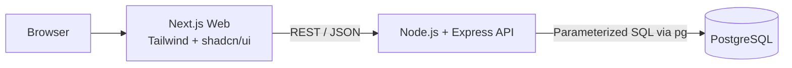
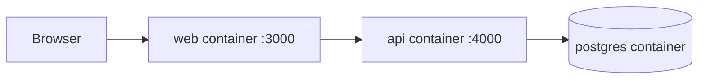

# Architecture

## Bootstrap topology



The bootstrap milestone has runnable web and API boundaries. PostgreSQL is represented by the Docker service, but migrations and domain queries are intentionally deferred to `feature/database-schema`.

## Frontend boundary

The Next.js App Router application owns pages, reusable components, Tailwind styling, shadcn/ui primitives, loading/error/empty states, and API client code. The frontend may validate input for user experience, but it is never the authority for authentication, authorization, fare correctness, ride transitions, or vehicle capacity.

## Backend boundary

The Express API will follow this dependency direction:

```text
Route
  ↓
Middleware
  ↓
Controller
  ↓
Service
  ↓
Repository
  ↓
PostgreSQL
```

Routes map HTTP methods and URLs. Middleware handles request IDs, authentication, roles, validation, and errors. Controllers translate HTTP requests and responses. Services own product rules. Repositories own SQL only. PostgreSQL enforces durable relationships, constraints, transactions, and locks.

The bootstrap API currently exposes `GET /health` and a small `/api` boundary. Authentication, rides, fares, matching, pools, and history will be added in later feature branches.

## Planned domain boundaries

The planned modules are auth, users, drivers, vehicles, rides, pools, matching, fares, and history. The ride state machine is centralized under the rides module. Pool acceptance will use a PostgreSQL transaction and `SELECT ... FOR UPDATE` before membership insertion.

## Containers



Docker Compose defines `web`, `api`, and `db`. The database service has a health check. Schema initialization is deliberately not part of the bootstrap container contract.
