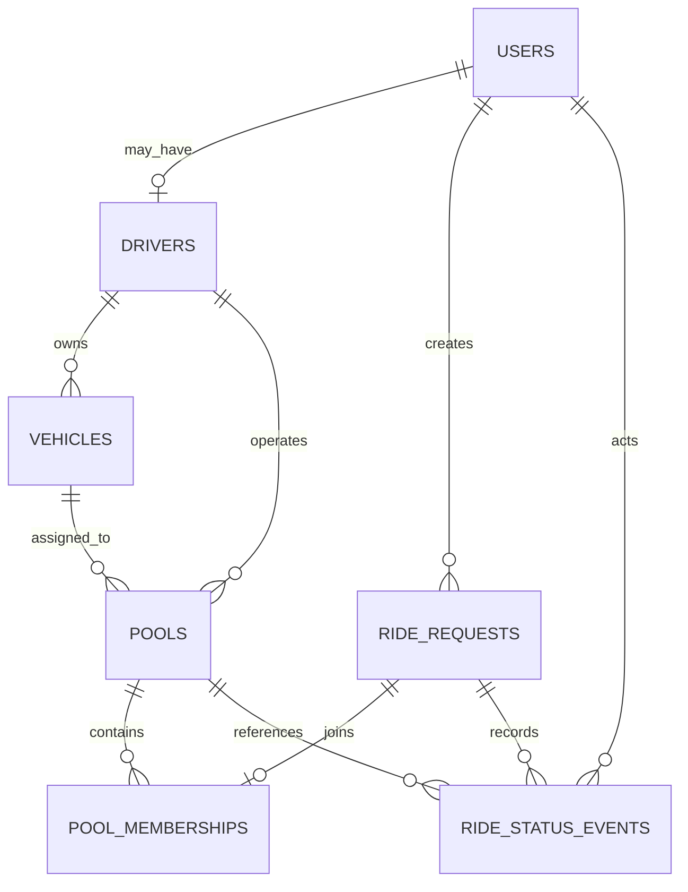

# Entity Relationship Diagram

This is the implemented database model. The tables are created through the
numbered migrations under `database/migrations` on `feature/database-schema`.

## Important distinction

- `ride_requests` represents one passenger's requested journey.
- `pools` represents one shared trip operated by one driver and vehicle.
- `pool_memberships` connects a ride request to a pool and stores reserved seats plus the passenger-specific fare.
- `ride_status_events` preserves append-only lifecycle history.

## Planned invariants

- user email is unique;
- a driver profile belongs to one user;
- a vehicle has positive capacity;
- a ride request has a supported route, positive seats, and a valid lifecycle state;
- one ride request has at most one pool membership;
- active membership seats must not exceed the pool's capacity snapshot;
- status changes are validated by one state-machine module and recorded as events.
